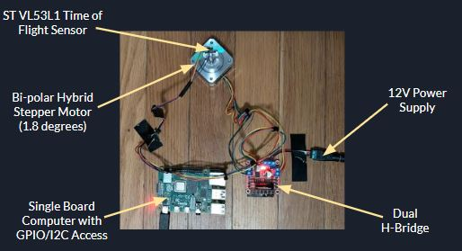
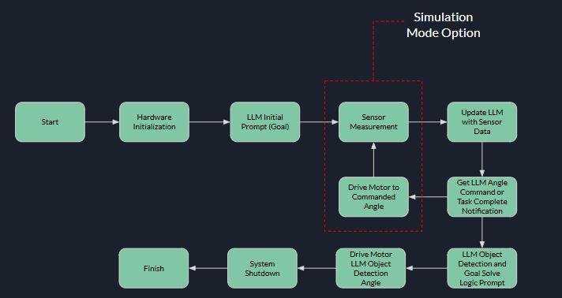

# LLM Spatial Environment Interaction: Raspberry Pi Motor Control and AI Integration Project
This project explores integrating Large Language Models (LLMs) with embedded systems for spatial environment interaction. It combines real-time hardware control and LLMs where hardware control is dicated by the LLM.

### Video Demo:  
https://youtu.be/ivJ1DE5Cfm4

### Introduction:
This project demonstrates the development of an embedded Linux Python application that integrates physical hardware with a Large Language Model (LLM). LLMs are unique AI models trained on vast and diverse text datasets, enabling them to perform abstract and generalized reasoning.

In contrast, typical edge devices interacting with their environments rely on neural networks trained on numerical sensor data for specific tasks. These models are task-focused and require extensive domain-specific training.

The goal of this project is to explore how LLMs can be used to reason about and control hardware, enabling task objectives that involve spatial awareness and dynamic interactions with the environment.

### Project Highlights:
 - Large Language Models (LLMs) Exploration: Programmatically interacted with LLMs to analyze their capabilities and limitations in solving spatial environment-related problems, gaining insights into their real-world applications and constraints.  Specifically, the AI agent was directed to find the closest obstacle based off of distance measurements relative to its position.
 - Embedded Application Development: Designed and implemented a Python-based application on an embedded Linux platform, leveraging the OOP paradigm for modular and scalable code.
 - Custom C-Library and API: Created a reusable C-library with a documented API to facilitate seamless hardware control and integration.
 - Python-C Interoperability: Developed Python wrappers for C-libraries, enabling higher-level abstractions for hardware interactions and improving usability.

### Key findings (To Date):
 - The LLM search path for finding the closest object varies significantly depending on the environment and prompt.  In some instances, a classic bisection method is invoked, whereas some instances appear to mimic a random search path.
 - The LLM will often restrict its search field, even when a +/- 90° field of view is explicitly mentioned in the initial prompt.  These instances mimic a local minima convergence where a global search method would be more appropriate.
 - The LLM has significant trouble associating the sequence of data it collects and the corresponding angle/measured distance data pair.  Significant time was spent developing the prompt to ensure the LLM understands data coherence in a spatial setting.

### Extensible Features:
 - LLM model type
 - LLM Prompts and task goals
 - Hardware unit types including Motor/Actuator and proximity sensors
 - Spatial simulation mode geometry (See usage)

### Hardware Requirements and System Design:
 - Raspberry Pi 4B (or compatible single board computer running a Linux embedded system)
 - ST vl53l1x Time of Flight Sensor
 - Any bipolar hybrid steppor motor, 1.8° step resolution, with compatible dual H-bridge hardware



*Figure 1: Stepper Motor and Sensor Configuration*


*Figure 2: Spatial Environment Example (2 Obstacles)*



*Figure 3: System State Machine*

### Software Requirements:
 - Python 3.7 or greater
 - See requirements list for required python libraries

### Firmware Requirements:
 - Update Linux OS kernel boot parameters under /boot/cmdline.txt with flag isolcpus=<cpu core>

### Installation:
 - Ensure you have `gcc`, `make`, and other necessary tools installed.
 - Navigate to 'libraries/VL53L1X/STSW-IMG013/user_lib' and build the STSW-IMG013 driver using make (see makefile for build details)
 - Navigate to 'libraries/Stepper_Motor_Hybrid and build the stepper motor driver using make (see makefile for build details)
 - If using openAI API, create an environment variable called:  OPENAI_API_KEY.  At the time of this implemenation, openAI's API requires a subscription.

### Code and Directory Structure:
```
LLM-spatial-scanner/
├── project.py
├── ai
│   ├── agent_base.py
│   ├── agent_openai.py
│   ├── prompts.json
├── hardware
│   ├── run_hardware.py
│   ├── simulation.py
│   ├── stepper_motor_control_wrapper.py
│   ├── VL53L1_wrapper.py
├── libraries
│   ├── VL53L1X
│   │   ├── STSW-IMG013
│   │   │   ├── user_lib
│   │   │   │   ├── Makefile
│   ├── Stepper_Motor_Hybrid
│   │   ├── include
│   │   │   ├── motor_control_api.h
│   │   │   ├── motor_gpio.h
│   │   │   ├── motor_timing.h
│   │   ├── src
│   │   │   ├── motor_control_api.c
│   │   │   ├── motor_gpio.c
│   │   │   ├── motor_timing.c
│   │   ├── main.c
│   │   ├── Makefile
├── tests
│   ├── test_project.py
│   ├── test_run_hardware.py
```

### Usage:

The codebase offers two different execution modes:
 - Simulation mode (Mode 1): Allows for real-time execution with full system integration with the exception of hardware elements.  The hardware elements are replaced using a simulation file.  The original simulation implemenation uses a simple line geometry to assess initial LLM control feasiblity and for system integration testing.  
 - Hardware mode (Mode 2): Includes all aspects of Mode 1 with the addtion of physical hardware, motors and sensors, which represents a full software and hardware integration.

Both modes are executed from the command line according to the following confiration options:
```bash
 python project.py -a <ai model> -m <mode> -p <prompt>
 ```
 - ai model:  LLM model to control hardware (e.g. GPT-4o)
 - mode: 1 or simulation, 2 for full system including hardware
 - prompt: prompts per ai/prompts.json

Example simulation mode execution:
```bash
 python project.py -a openAI -m 1 -p 2
 ```

 Example hardware mode execution:
```bash
 python project.py -a openAI -m 2 -p 3
 ```